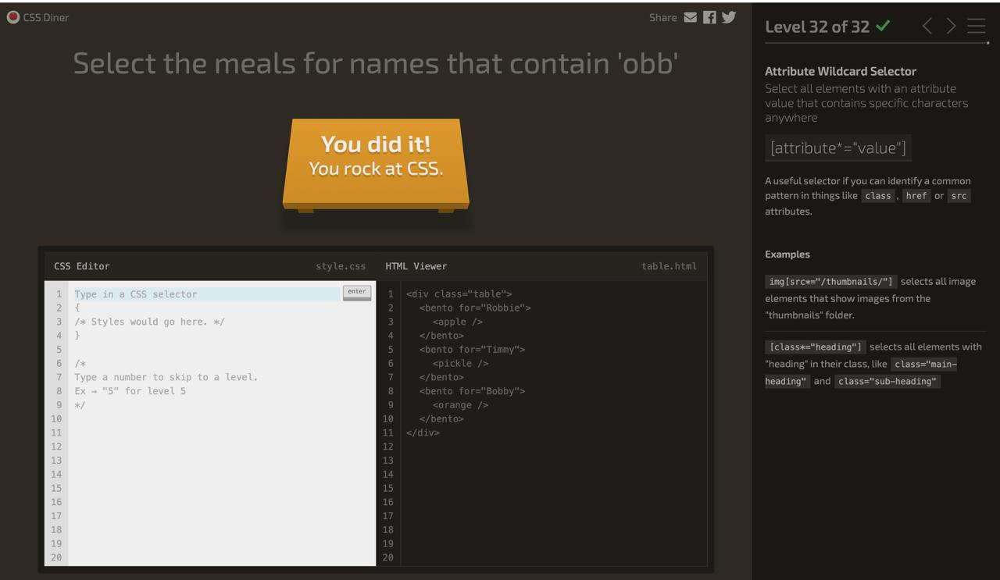

# Week 6 – Log (Feb 23- March 1)

## What I learned this week
-I advanced a lot in my fitness app. I was able to find a customer and define how I want it to look like
-How display: flex works and how to use justify-content and align-items
-The difference between Flexbox (one direction) and Grid (rows + columns)
-How to use gap for spacing
-How repeat(auto-fit, minmax(250px, 1fr)) makes layouts responsive

## Challenges I faced
-Playing the CSS game was pretty challenging but I did good in the end!! 

## Questions going forward
-What’s the best way to make layouts fully responsive on all screen sizes?
-How can I combine Flexbox and Grid on the same page effectively?
-How do I center content both horizontally and vertically?
-What are common layout mistakes to avoid?
